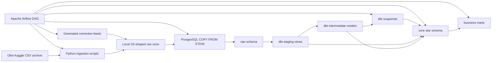
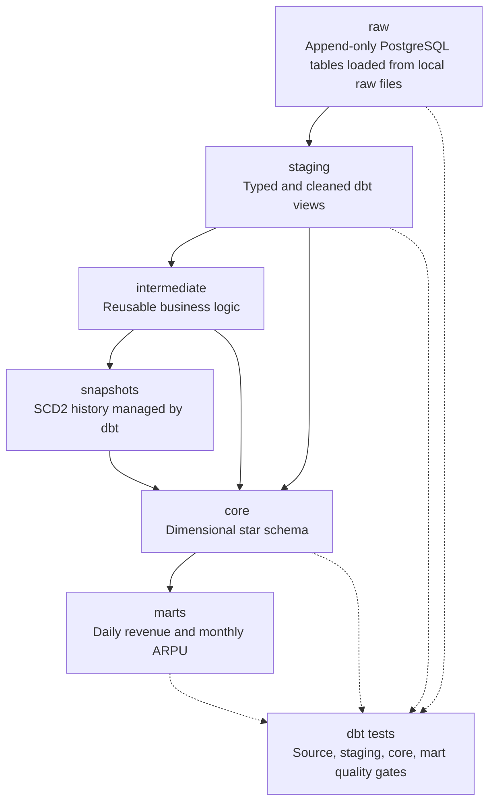
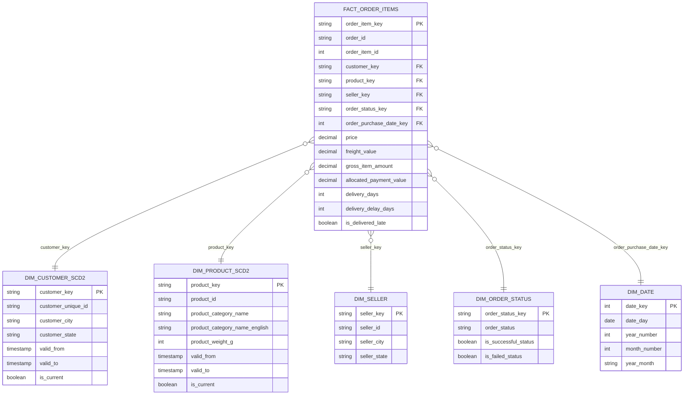
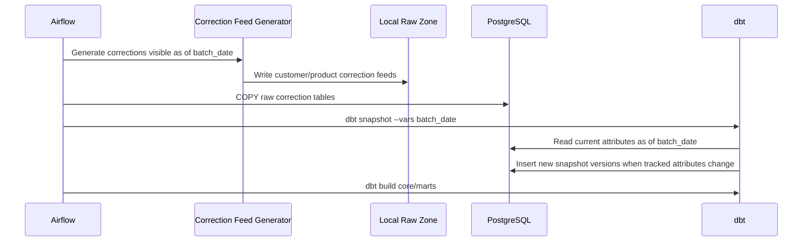

# Diagrams

## End-To-End Architecture

```mermaid
flowchart LR
    source["Olist Kaggle CSV archive"]
    corrections["Generated correction feeds"]
    ingestion["Python ingestion scripts"]
    rawzone["Local S3-shaped raw zone"]
    copy["PostgreSQL COPY FROM STDIN"]
    raw["raw schema"]
    staging["dbt staging views"]
    intermediate["dbt intermediate models"]
    snapshots["dbt snapshots"]
    core["core star schema"]
    marts["business marts"]
    airflow["Apache Airflow DAG"]

    airflow --> ingestion
    airflow --> corrections
    airflow --> copy
    airflow --> snapshots
    airflow --> core
    airflow --> marts

    source --> ingestion
    corrections --> rawzone
    ingestion --> rawzone
    rawzone --> copy
    copy --> raw
    raw --> staging
    staging --> intermediate
    intermediate --> snapshots
    snapshots --> core
    staging --> core
    intermediate --> core
    core --> marts
```

## Warehouse Layers

```mermaid
flowchart TB
    raw["raw\nAppend-only PostgreSQL tables loaded from local raw files"]
    staging["staging\nTyped and cleaned dbt views"]
    intermediate["intermediate\nReusable business logic"]
    snapshots["snapshots\nSCD2 history managed by dbt"]
    core["core\nDimensional star schema"]
    marts["marts\nDaily revenue and monthly ARPU"]
    tests["dbt tests\nSource, staging, core, mart quality gates"]

    raw --> staging
    staging --> intermediate
    intermediate --> snapshots
    snapshots --> core
    staging --> core
    intermediate --> core
    core --> marts

    raw -.-> tests
    staging -.-> tests
    core -.-> tests
    marts -.-> tests
```

## Core Star Schema

```mermaid
erDiagram
    FACT_ORDER_ITEMS {
        string order_item_key PK
        string order_id
        int order_item_id
        string customer_key FK
        string product_key FK
        string seller_key FK
        string order_status_key FK
        int order_purchase_date_key FK
        decimal price
        decimal freight_value
        decimal gross_item_amount
        decimal allocated_payment_value
        int delivery_days
        int delivery_delay_days
        boolean is_delivered_late
    }

    DIM_CUSTOMER_SCD2 {
        string customer_key PK
        string customer_unique_id
        string customer_city
        string customer_state
        timestamp valid_from
        timestamp valid_to
        boolean is_current
    }

    DIM_PRODUCT_SCD2 {
        string product_key PK
        string product_id
        string product_category_name
        string product_category_name_english
        int product_weight_g
        timestamp valid_from
        timestamp valid_to
        boolean is_current
    }

    DIM_SELLER {
        string seller_key PK
        string seller_id
        string seller_city
        string seller_state
    }

    DIM_ORDER_STATUS {
        string order_status_key PK
        string order_status
        boolean is_successful_status
        boolean is_failed_status
    }

    DIM_DATE {
        int date_key PK
        date date_day
        int year_number
        int month_number
        string year_month
    }

    FACT_ORDER_ITEMS }o--|| DIM_CUSTOMER_SCD2 : customer_key
    FACT_ORDER_ITEMS }o--|| DIM_PRODUCT_SCD2 : product_key
    FACT_ORDER_ITEMS }o--|| DIM_SELLER : seller_key
    FACT_ORDER_ITEMS }o--|| DIM_ORDER_STATUS : order_status_key
    FACT_ORDER_ITEMS }o--|| DIM_DATE : order_purchase_date_key
```

## SCD2 Simulation Flow

```mermaid
sequenceDiagram
    participant Airflow
    participant Generator as Correction Feed Generator
    participant RawZone as Local Raw Zone
    participant Postgres as PostgreSQL
    participant dbt

    Airflow->>Generator: Generate corrections visible as of batch_date
    Generator->>RawZone: Write customer/product correction feeds
    Airflow->>Postgres: COPY raw correction tables
    Airflow->>dbt: dbt snapshot --vars batch_date
    dbt->>Postgres: Read current attributes as of batch_date
    dbt->>Postgres: Insert new snapshot versions when tracked attributes change
    Airflow->>dbt: dbt build core/marts
```
